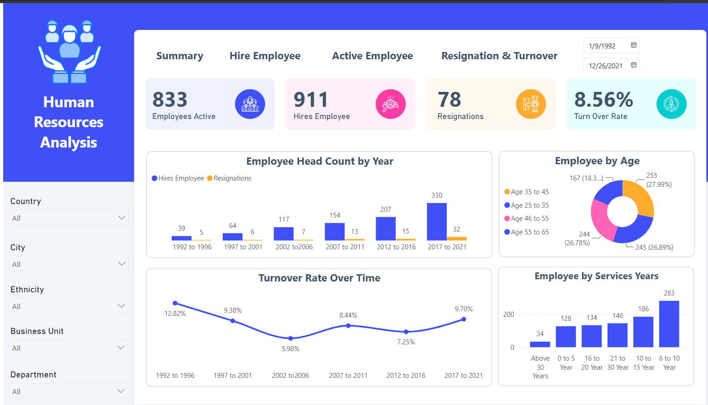
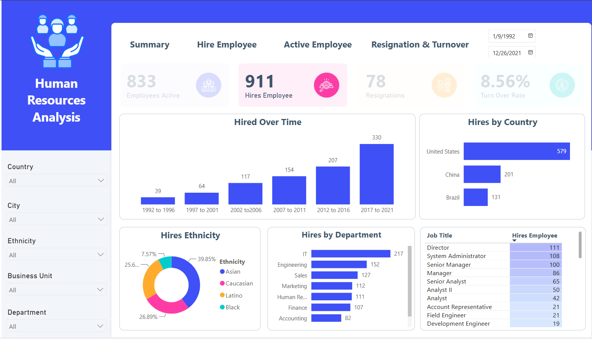
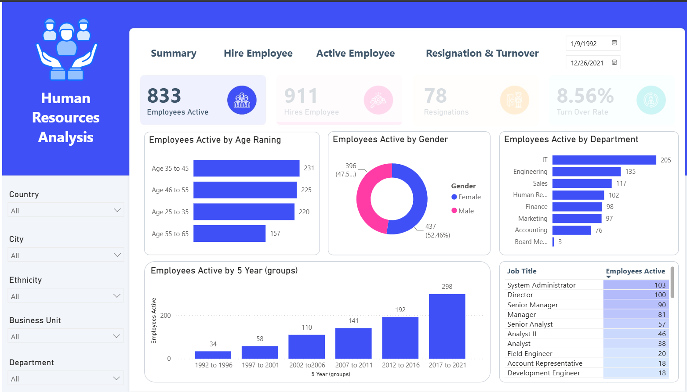
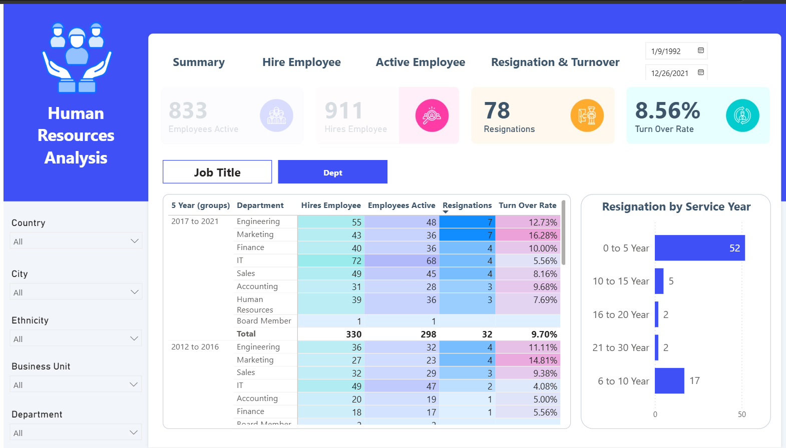

# 👥 Human Resources Analytics Dashboard | Power BI

## Project Overview

This project presents an interactive Human Resources Analytics Dashboard developed in Power BI to monitor workforce performance, employee demographics, hiring trends, and employee turnover.

The dashboard enables HR teams and business leaders to gain actionable insights into workforce composition, hiring activities, employee retention, and organizational growth.

---

## 🚀 Live Dashboard

🔗 

## 🎯 Business Objective

The objective of this dashboard is to provide HR stakeholders with a centralized reporting solution to:

* Monitor active employee headcount
* Track hiring and resignation trends
* Analyze employee demographics
* Measure employee turnover rates
* Support workforce planning and retention strategies

---

## 🛠️ Technology Stack

* Power BI Desktop
* Power Query
* DAX (Data Analysis Expressions)
* Data Modeling
* Interactive Reporting

---

## 📊 Dashboard Overview

### Key Performance Indicators (KPIs)

| KPI              | Description                     |
| ---------------- | ------------------------------- |
| Active Employees | Current active workforce        |
| Hires Employee   | Total employees hired           |
| Resignations     | Total employee resignations     |
| Turnover Rate    | Percentage of employee turnover |

### Current Dashboard Metrics

* **Active Employees:** 833
* **Hires Employee:** 911
* **Resignations:** 78
* **Turnover Rate:** 8.56%

---

## 📸 Dashboard Pages

### 1. Summary Dashboard

Provides a high-level overview of workforce performance and key HR metrics.

**Highlights**

* Active Employees
* Total Hires
* Total Resignations
* Turnover Rate
* Employee Demographics

---

### 2. Hire Employee Analysis

Analyzes employee hiring trends across departments, locations, and time periods.

**Highlights**

* Hiring Trends
* New Employees by Department
* Hiring by Location
* Hiring by Business Unit

---

### 3. Active Employee Analysis

Provides insights into the current workforce composition.

**Highlights**

* Active Employee Headcount
* Employee Distribution
* Age Demographics
* Department Analysis
* Service Year Analysis

---

### 4. Resignation & Turnover Analysis

Tracks employee resignations and workforce turnover metrics.

**Highlights**

* Resignation Trends
* Turnover Rate Analysis
* Attrition by Department
* Attrition by Location
* Retention Performance

---

## 📈 Key Insights

### Workforce Growth

* Total hires significantly exceed resignations.
* The organization demonstrates consistent workforce expansion.

### Employee Retention

* Turnover rate remains below 10%.
* Employee retention performance is relatively stable.

### Workforce Demographics

* Employees are distributed across multiple age groups.
* Service year analysis helps identify workforce experience levels and retention patterns.

### HR Decision Support

* Enables HR teams to monitor hiring effectiveness.
* Supports workforce planning and retention strategies.
* Provides actionable insights for management and business leaders.

---c

## 💡 Skills Demonstrated

### Power BI

* Dashboard Development
* Interactive Reporting
* KPI Design
* Data Storytelling
* Data Visualization

### Data Modeling

* Relationship Management
* Star Schema Design
* DAX Measures
* Calculated Columns

### HR Analytics

* Workforce Analysis
* Employee Retention Analysis
* Attrition Monitoring
* Demographic Analysis

## Author

**Alex Kaung**

Data Engineer | BI Developer | Data Analyst

GitHub: https://github.com/KaungAlex
